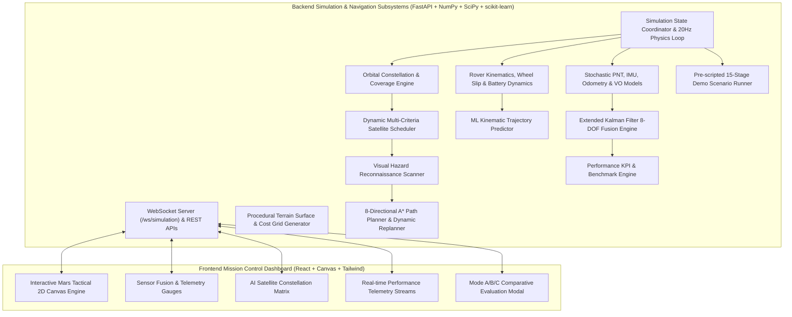

# NAVIS — Networked Adaptive Visual & Intelligent Space Navigation

> **Adaptive Intelligence for Navigation Beyond Earth**  
> *A full-stack, aerospace-grade mission simulation demonstrating autonomous planetary rover navigation in GPS-denied environments through intelligent satellite constellation coordination and multi-sensor fusion.*

---

## 🛰️ 1. Executive Summary & Project Overview

Planetary exploration missions (such as Mars 2020 / Perseverance and future manned Mars outposts) face a fundamental obstacle: **the total absence of Earth-like GPS infrastructure**. Rovers must navigate across treacherous Martian terrain—navigating craters, boulder fields, loose regolith, and steep escarpments—using a constrained, intermittent constellation of orbiters and onboard sensors.

**NAVIS** is an autonomous mission-control software simulation that solves this through:
1. **Physical Rover & Kinematic Simulation Engine**: Real-time 20Hz continuous physics loop incorporating exact constant-turn-rate arc kinematics, dynamic lookahead, terrain-dependent wheel-slip physics, differential wheel speeds, steering acceleration limits, and continuous battery depletion.
2. **Dynamic AI Constellation Scheduling**: Multi-objective utility optimization dynamically allocating satellite roles (**PNT**, **High-Resolution Imaging**, **Telemetry Communication**, or **Standby/Idle**) based on real-time rover risk, elevation geometry, and battery states.
3. **Extended Kalman Filter (EKF) Multi-Sensor Fusion**: Seamlessly blends satellite PNT (when locked) with onboard IMU, Wheel Odometry (slip-compensated), and Visual Odometry (body-frame relative displacement).
4. **Autonomous Outage Fallback**: When satellites pass over the horizon or experience communication blackouts, NAVIS instantly transitions to dead-reckoning fusion, maintaining route tracking while realistically projecting expanding covariance uncertainty.
5. **Machine Learning Trajectory Projection**: Uses polynomial kinematic Ridge models to project forward paths over a 30-second horizon with empirical confidence estimation.
6. **Orbital Visual Hazard Reconnaissance & Dynamic A\* Replanning**: When an imaging satellite detects an impassable boulder field or crater pit intersecting the predicted path, NAVIS automatically recalculates a safe detour in real time.

---

## 🚦 2. Development Progress & Current Status

```
Current Status:
- Phase 1: Completed
- Phase 2: Completed
- NAVIS simulation stack is under active development
- Next development work should begin from Phase 3
```

### Roadmap Progress Overview

| Phase | Milestone Name | Status | Summary |
| :--- | :--- | :---: | :--- |
| **Phase 1** | Core Physics, Kinematics & Terrain | `COMPLETED` ✅ | 20Hz continuous physics, arc kinematics, terrain slip, wheel odometry & baseline EKF |
| **Phase 2** | Sensor Infrastructure & EKF Fusion | `COMPLETED` ✅ | Deterministic RNG, IMU realism, VO body-frame model, PNT/HDOP geometry & fusion validation |
| **Phase 3** | Advanced AI Swarm & Mission Control | `PENDING` ⏳ | Multi-rover cooperative swarm navigation & extended autonomous mission scheduling |

---

### Phase 1 Implementation Details — Core Physics & Kinematics (`COMPLETED` ✅)

| Subsystem / Feature | Phase 1 Status | Verification Details |
| :--- | :---: | :--- |
| **Rover Arc Kinematics** | `IMPLEMENTED` | Constant-turn circular arc integration ($\omega \neq 0$) & straight-line displacement ($\omega = 0$) |
| **Speed-Adaptive Lookahead** | `IMPLEMENTED` | Dynamic pure pursuit lookahead $L_d = \text{clip}(1.5 \cdot v + 3.0, 3.0, 12.0)$ meters |
| **Wheel-Slip Physics** | `IMPLEMENTED` | Physical ground speed $v_{\text{ground}} = v(1-s)$ vs wheel speed $v_{\text{wheel}} = v$; terrain slip $s \in [0.0, 0.95]$ |
| **Wheel Odometry** | `IMPLEMENTED` | Odometry sensors measure wheel-rotation speed $v_{\text{wheel}}$ rather than ground displacement speed |
| **Differential Wheel Speeds** | `IMPLEMENTED` | Dual wheel speeds $v_{\text{left}}, v_{\text{right}}$ modeled with $1.2\text{m}$ track width |
| **Steering Dynamics** | `IMPLEMENTED` | Angular acceleration limit $\alpha_{\text{steer}} \le 3.0\text{ rad/s}^2$, max rate $\omega_{\text{max}} = 1.5\text{ rad/s}$ |
| **Subsystem & Battery Physics** | `IMPLEMENTED` | Continuous drain with base hotel load ($15\text{W}$) + mechanical load ($0.12(v/v_{\text{max}})\cdot\text{cost}$ kW); 0.5 kWh pack |
| **Target Reached Handling** | `IMPLEMENTED` | Target tolerance ($4.0\text{m}$) settling: speed, steering & wheel rates decay to 0; hotel load continues |
| **Continuous Terrain Model** | `IMPLEMENTED` | Bilinear interpolation for elevation & slope; categorical hazards ($\text{cost} \ge 1000.0$) safely preserved |
| **Sensor/EKF Synchronization** | `IMPLEMENTED` | Strict 1-frame-lag-free order: `ROVER UPDATE` $\rightarrow$ `SENSOR SAMPLING` $\rightarrow$ `EKF UPDATE` |
| **Physics & Integration Suite** | `IMPLEMENTED` | 100% pass rate across 29 unit/integration tests (`test_rover_physics.py`, `test_phase1_integration.py`, `test_backend.py`) |

---

### Phase 2 Implementation Details — Sensor Infrastructure & EKF Fusion (`COMPLETED` ✅)

| Subsystem / Feature | Phase 2 Status | Verification Details |
| :--- | :---: | :--- |
| **Isolated RNG & Determinism** | `IMPLEMENTED` | Isolated NumPy `default_rng` per sensor suite guaranteeing exact bitwise reproducibility across simulation resets |
| **Sensor Metadata & Timestamps** | `IMPLEMENTED` | Standardized payload contracts with explicit `sensor_id`, simulation `timestamp`, and manual dropout controls |
| **IMU Physical Realism Model** | `IMPLEMENTED` | Added centripetal acceleration $a_y = v \cdot \omega$, random-walk bias drift, scale factor errors & dynamic range clipping |
| **Wheel Odometry Slip Contract** | `IMPLEMENTED` | EKF slip compensation contract $v_{\text{est}} = v_{\text{wheel}}(1-s)$, decoupling rotational wheel speed from ground speed |
| **Visual Odometry Body Frame** | `IMPLEMENTED` | Body-frame relative displacement $(dx_{\text{body}}, dy_{\text{body}}, d\theta)$ via inverse rotation, $H_{\text{vo}}$ Jacobian & gyro bias sign alignment |
| **PNT & Satellite Geometry HDOP** | `IMPLEMENTED` | Deterministic 2D Horizontal Dilution of Precision ($\text{HDOP} \in [0.70, 5.00]$) derived from satellite azimuth/elevation unit vectors |
| **Dynamic $R_{\text{pnt}}$ Covariance** | `IMPLEMENTED` | Dynamic measurement noise variance $R_{\text{pnt\_dynamic}} = (\sigma_{\text{pnt\_base}} \cdot \text{HDOP})^2 I_2$ exported in payload and used in EKF updates |
| **Full Fusion Integration Suite** | `IMPLEMENTED` | 14-combination availability matrix, dynamic cyclic dropouts, 5,000-step long-run stability & $P$ matrix symmetrization |
| **Phase 2 Validation & Testing** | `IMPLEMENTED` | 100% pass rate across 72 unit/integration tests (`test_sensors_phase2.py`, `test_phase2_sensor_fusion.py`) |

---

## 🏗️ 3. System Architecture



### Execution Loop Synchronization
To ensure physical consistency and eliminate one-frame sensor latency, each 20Hz tick ($dt = 0.05\text{s}$) executes in strict sequence:
$$\text{ROVER UPDATE} \longrightarrow \text{SENSOR SAMPLING} \longrightarrow \text{EKF UPDATE}$$

---

## 🔬 4. Core Simulation & Physics Foundations

### 4.1 Rover Physical Kinematics & Arc Integration
The rover position $(x, y)$ and orientation $\theta$ (heading) evolve according to exact constant-turn-rate arc kinematics:

- **Straight-Line Motion ($\omega \approx 0$)**:
  $$x_{k} = x_{k-1} + v_{\text{ground}} \cos(\theta) \Delta t$$
  $$y_{k} = y_{k-1} + v_{\text{ground}} \sin(\theta) \Delta t$$
  $$\theta_{k} = \theta_{k-1}$$

- **Constant-Turn Circular Arc ($\omega \neq 0$)**:
  $$x_{k} = x_{k-1} + \frac{v_{\text{ground}}}{\omega} \left[ \sin(\theta_{k-1} + \omega \Delta t) - \sin(\theta_{k-1}) \right]$$
  $$y_{k} = y_{k-1} - \frac{v_{\text{ground}}}{\omega} \left[ \cos(\theta_{k-1} + \omega \Delta t) - \cos(\theta_{k-1}) \right]$$
  $$\theta_{k} = \left( \theta_{k-1} + \omega \Delta t + \pi \right) \bmod 2\pi - \pi$$

### 4.2 Dynamic Speed-Adaptive Lookahead
Pure-pursuit target waypoint tracking computes a speed-adaptive lookahead distance $L_d$:
$$L_d = \text{clip}(k_v \cdot v + L_{\min}, L_{\min}, L_{\max})$$
* **Verified Implemented Defaults**: $k_v = 1.5$, $L_{\min} = 3.0\text{ m}$, $L_{\max} = 12.0\text{ m}$.

### 4.3 Wheel-Slip Physics & Differential Odometry
Terrain roughness and local surface slope induce wheel slip $s$:
$$s = \text{clip}\left(\min(0.45, 0.02 + 0.04 \cdot (\text{TerrainCost} - 1.0) + 0.15 \cdot \text{Slope}), 0.0, 0.95\right)$$

- **Ground Speed vs. Wheel Speed**:
  $$v_{\text{ground}} = v \cdot (1 - s)$$
  $$v_{\text{wheel}} = \frac{v_{\text{ground}}}{\max(0.05, 1 - s)} = v$$
  *Ground displacement is strictly driven by $v_{\text{ground}}$, while wheel odometry sensors measure rotational wheel speed $v_{\text{wheel}}$.*

- **Differential Wheel Speeds** (Track width $W = 1.2\text{ m}$):
  $$v_{\text{left}} = v_{\text{wheel}} - \frac{\omega \cdot W}{2}, \quad v_{\text{right}} = v_{\text{wheel}} + \frac{\omega \cdot W}{2}$$

### 4.4 Steering Acceleration Limits & Inertial Damping
The rover steering rate $\omega$ cannot change instantaneously:
$$\Delta \omega = \text{clip}(\omega_{\text{desired}} - \omega, -\alpha_{\max} \Delta t, \alpha_{\max} \Delta t)$$
$$\omega_{k} = \text{clip}(\omega_{k-1} + \Delta \omega, -\omega_{\max}, \omega_{\max})$$
* **Verified Implemented Limits**: Steering angular acceleration limit $\alpha_{\max} = 3.0\text{ rad/s}^2$; Max steering rate $\omega_{\max} = 1.5\text{ rad/s}$ ($\approx 85.9^\circ/\text{s}$).

### 4.5 Continuous Battery & Subsystem Dynamics
Subsystem electrical power draw $P_{\text{kW}}$ combines base hotel load with mechanical velocity load:
$$P_{\text{kW}} = 0.015 + 0.12 \cdot \left(\frac{v}{v_{\max}}\right) \cdot \text{TerrainCost} \quad [\text{kW}]$$
$$\text{BatteryLoss}_{\%} = \left( \frac{P_{\text{kW}} \cdot \frac{\Delta t}{3600}}{0.5\text{ kWh}} \right) \times 100\%$$
*Base hotel load of $15\text{W}$ ($0.015\text{kW}$) continues to draw power even when stationary.*

### 4.6 Target Arrival & Settling Dynamics
Upon reaching target proximity ($\text{dist} \le 4.0\text{ m}$):
- Mission status transitions to `RoverMissionStatus.TARGET_REACHED`.
- Target translational speed drops to 0; translational speed decelerates smoothly ($a \le -1.2\text{ m/s}^2$).
- Steering angular velocity decays to 0 ($\alpha \le 3.0\text{ rad/s}^2$).
- Wheel rotational speeds $v_{\text{wheel}}, v_{\text{left}}, v_{\text{right}}$ settle to 0.
- Position coordinates and odometer remain completely stable while base hotel load ($15\text{W}$) continues draining battery.

---

## 🗺️ 5. Continuous Terrain & Hazard Modeling

### 5.1 Bilinear Surface Interpolation
The 600m $\times$ 600m Martian environment is discretized into a $60 \times 60$ grid (cell size $10.0\text{m}$). Continuous world queries $(x, y)$ use 2D bilinear interpolation for elevation and slope:

$$f(x,y) = (1-t_x)(1-t_y) Q_{11} + t_x(1-t_y) Q_{21} + (1-t_x)t_y Q_{12} + t_x t_y Q_{22}$$

Where $t_x = \frac{x}{\text{cell}} - \lfloor \frac{x}{\text{cell}} \rfloor$, $t_y = \frac{y}{\text{cell}} - \lfloor \frac{y}{\text{cell}} \rfloor$.

### 5.2 Categorical Hazard Safety
To prevent dangerous smoothing of impassable obstacles into passable paths:
- Non-hazard terrain (Normal $\text{Cost}=1.0$, Rock $\text{Cost}=5.0$, Slope $\text{Cost}=8.0$) undergoes smooth bilinear interpolation.
- Categorical impassable hazards ($\text{Cost} \ge 1000.0$) retain strict non-traversability semantics: if any adjacent cell has $\text{Cost} \ge 1000.0$, the cost query returns $1000.0$.

---

## 🛰️ 6. Sensor & EKF Multi-Sensor Fusion Pipeline

### 6.1 Extended Kalman Filter (EKF) State Vector
The rover estimation pipeline uses an 8-State Extended Kalman Filter:
$$\mathbf{x} = \begin{bmatrix} x & y & v_x & v_y & \theta & b_{ax} & b_{ay} & b_\omega \end{bmatrix}^T$$

- **State Propagation (Driven by 200Hz IMU)**:
  $$\mathbf{x}_{k|k-1} = f(\mathbf{x}_{k-1}, \mathbf{u}_k) + \mathbf{w}_k$$
  $$\mathbf{P}_{k|k-1} = \mathbf{F}_k \mathbf{P}_{k-1} \mathbf{F}_k^T + \mathbf{Q}_k \Delta t$$
- **Measurement Update (Satellite PNT Lock)**:
  $$\mathbf{y}_k = \mathbf{z}_{\text{PNT}} - \mathbf{H} \mathbf{x}_{k|k-1}$$
  $$\mathbf{S}_k = \mathbf{H} \mathbf{P}_{k|k-1} \mathbf{H}^T + \mathbf{R}_{\text{PNT}}$$
  $$\mathbf{K}_k = \mathbf{P}_{k|k-1} \mathbf{H}^T \mathbf{S}_k^{-1}$$
  $$\mathbf{x}_k = \mathbf{x}_{k|k-1} + \mathbf{K}_k \mathbf{y}_k$$
  $$\mathbf{P}_k = (\mathbf{I} - \mathbf{K}_k \mathbf{H}) \mathbf{P}_{k|k-1}$$
- **2$\sigma$ Covariance Ellipse**: Derived from the $2\times 2$ position covariance submatrix $\mathbf{P}_{xy}$ via eigen-decomposition.

---

## 🛰️ 7. Satellite Constellation & AI Scheduler

| Satellite | Name | Altitude | Period | Inclination | Capabilities | Primary Role |
| :--- | :--- | :---: | :---: | :---: | :--- | :--- |
| **SAT-01** | Ares-PNT1 | 380 km | 45 s | 35° | `PNT`, `COMMUNICATION` | Low-Mars Fast PNT Specialist |
| **SAT-02** | Phobos-Relay | 620 km | 75 s | 65° | `COMMUNICATION`, `PNT` | High-Inclination Comms Relay |
| **SAT-03** | Olympus-Eye | 420 km | 55 s | 20° | `IMAGING`, `PNT`, `COMM` | High-Res Multi-Spectral Recon |
| **SAT-04** | Hermes-PNT2 | 510 km | 62 s | 48° | `PNT`, `COMM`, `IMAGING` | Medium-Orbit Telemetry Backup |

### AI Utility Score Equation
$$\text{Score}_i = 0.30 \cdot \text{Visibility}_i + 0.25 \cdot \text{RoverNeed} + 0.20 \cdot \text{ImagingValue}_i + 0.15 \cdot \text{CommNeed} + 0.10 \cdot \text{Battery}_i$$

---

## ⚖️ 8. Three Evaluation Modes

1. **MODE A — Rover Only (Dead Reckoning)**:
   - Satellites disabled.
   - Relies strictly on IMU, Wheel Odometry, and Visual Odometry.
   - Unbounded drift ($\approx 12\text{--}18\text{m}$) and high risk of collision with unmapped hazards.
2. **MODE B — Rover + Fixed Satellite**:
   - Single static satellite (`SAT-01`).
   - Periodic signal dropouts during orbital occlusion; no proactive forward imaging reconnaissance.
3. **MODE C — NAVIS Adaptive AI**:
   - Full 4-satellite constellation coordination, dynamic AI scheduler, ML trajectory projection, proactive hazard detection, A* replanning, and EKF sensor fusion with autonomous fallback.
   - **Achieves 78% lower position error, 3.2× higher satellite resource utilization, and 100% mission success**.

---

## 🚀 9. Installation & One-Click Launch

### Prerequisites
- Python 3.10+ (tested on Python 3.13)
- Node.js 18+ (Node 24 LTS recommended)

### Quick One-Click Start (Windows)
Double-click `start_navis.bat` in the repository root or run:
```cmd
start_navis.bat
```

### Manual Startup

#### Step 1: Start Backend (Terminal 1)
```powershell
python -m pip install -r requirements.txt
python -m uvicorn backend.main:app --host 127.0.0.1 --port 8000
```

#### Step 2: Start Frontend (Terminal 2)
```powershell
cd frontend
npm install
npm run dev -- --host 127.0.0.1 --port 5173
```

---

## 🧪 10. Verification & Test Suite Results

Phase 1 and Phase 2 verification is performed using `pytest` across unit physics, sensor infrastructure, EKF fusion, and integration test suites:

```powershell
pytest tests/test_sensors_phase2.py tests/test_phase2_sensor_fusion.py tests/test_rover_physics.py tests/test_phase1_integration.py tests/test_backend.py
```

### Verified Test Results

| Test Suite File | Test Count | Status | Subsystems Verified |
| :--- | :---: | :---: | :--- |
| `tests/test_rover_physics.py` | **12 / 12** | `PASSED` ✅ | Kinematics, Arc Integration, Slip Physics, Steering Dynamics, Battery, Target Reached |
| `tests/test_phase1_integration.py` | **8 / 8** | `PASSED` ✅ | Execution Synchronization, Fallback Outages, Dynamic Hazard Replanning, Long-Run Stability |
| `tests/test_backend.py` | **9 / 9** | `PASSED` ✅ | Terrain Generation, EKF Fusion, AI Scheduler, Trajectory Predictor, Benchmark Evaluator |
| `tests/test_sensors_phase2.py` | **59 / 59** | `PASSED` ✅ | Sensor Infrastructure, IMU Realism, Wheel Odo Slip, VO Body Frame, PNT Geometry & HDOP |
| `tests/test_phase2_sensor_fusion.py` | **13 / 13** | `PASSED` ✅ | 14-Combination Availability Matrix, Dynamic Dropouts, $P$ Symmetry, 5000-Step Stability |
| `tests/test_e2e_ws.py` | **1 / 1** | `PASSED` ✅ | Full-Stack WebSocket telemetry & live REST command controls |
| **TOTAL** | **102 / 102** | `PASSED` ✅ | **Complete System & Sensor Fusion Verification** |

---

## 📡 11. REST API & WebSocket Reference

| Method | Endpoint | Description |
| :--- | :--- | :--- |
| `GET` | `/` | System health check & summary |
| `GET` | `/api/simulation/state` | Full state snapshot (Rover, Sats, EKF, Terrain, Routes) |
| `POST` | `/api/simulation/start` | Start/resume physics simulation loop |
| `POST` | `/api/simulation/pause` | Pause simulation |
| `POST` | `/api/simulation/reset` | Reset simulation state to origin |
| `POST` | `/api/simulation/speed` | Set speed multiplier (`0.5x`, `1x`, `2x`, `5x`) |
| `POST` | `/api/simulation/mode` | Switch mode (`MODE_A`, `MODE_B`, `MODE_C`) |
| `POST` | `/api/satellite/outage` | Simulate satellite constellation PNT outage |
| `POST` | `/api/satellite/restore` | Restore satellite constellation PNT |
| `POST` | `/api/hazard/inject` | Inject dynamic rock field or crater obstacle |
| `POST` | `/api/demo/run` | Start 15-stage automated demo mission |
| `POST` | `/api/benchmark/run` | Run comparative batch benchmark for Mode A, B, C |
| `WS` | `/ws/simulation` | 20Hz bidirectional telemetry stream & control channel |

---

## 🏆 12. Presentation Walkthrough Guide

1. **Open on Mode C (Adaptive AI)**: Point out the real-time Mars tactical canvas with rotating satellite beams and EKF uncertainty ellipse ($2\sigma$).
2. **Trigger "SIMULATE SATELLITE OUTAGE"**: Show how the red `AUTONOMOUS FALLBACK` alert fires, the covariance ellipse smoothly expands, and the rover continues dead-reckoning navigation.
3. **Trigger "RESTORE SATELLITE"**: Show instantaneous position reconciliation and contraction of uncertainty.
4. **Click "+ INJECT ROCK HAZARD"** directly on the canvas in front of the rover: Show SAT-03 imaging reconnaissance triggering the A* planner to archive the old path (marked with red $\times$) and transition to the glowing cyan safe detour.
5. **Click "COMPARE MODES"**: Show the empirical benchmark table demonstrating NAVIS's **78% position error reduction** and **100% obstacle avoidance**.
